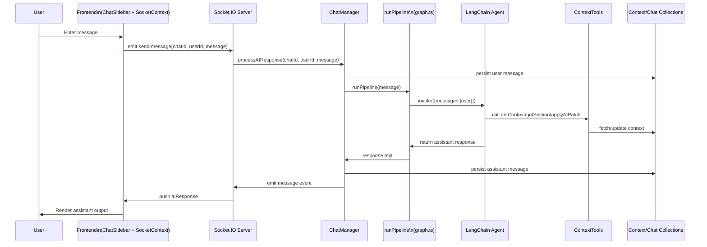

# AI Chat System Reference

## Learnings

- The LangChain chat model configuration lives in [chatAgent.ts.createChatModel()](backend/src/ai/chatAgent.ts:24) which validates OpenRouter environment variables with Zod before instantiating `ChatOpenAI`.
- [chatAgent.ts.editingAgent](backend/src/ai/chatAgent.ts:43) composes the agent with the context-aware tools (`getContext`, `getSection`, `applyAIPatch`) and a `MemorySaver` checkpointer so user/file scoped calls can share state.
- [chatAgent.ts.runChat()](backend/src/ai/chatAgent.ts:65) illustrates invoking the agent with user prompts while injecting `user_id` and `file_id` into the runtime context for downstream tool access.

## Backend pipeline and persistence

- [graph.ts.runPipeline()](backend/src/ai/graph.ts:3) lazily instantiates the main agent via [mainAgent.ts.createMainAgent()](backend/src/ai/mainAgent.ts:10) and returns the assistant's latest message content.
- [ChatManager.ts.processAIResponse()](backend/src/managers/ChatManager.ts:46) stores user and assistant turns in Mongo through [Chat.ts](backend/src/models/Chat.ts:1) while delegating inference to the pipeline.
- Contextual file state is maintained by [ContextManager.ts](backend/src/managers/ContextManager.ts:1), with summaries from [ContextManager.ts.getContext()](backend/src/managers/ContextManager.ts:35), targeted retrieval from [ContextManager.ts.getSection()](backend/src/managers/ContextManager.ts:73), and patch application via [ContextManager.ts.applyAIPatch()](backend/src/managers/ContextManager.ts:144).

## Frontend chat integration

- [SocketContext.tsx](frontend/src/contexts/SocketContext.tsx:30) provides chat/file actions backed by [socket.ts.SocketManager](frontend/src/lib/socket.ts:5) which handles Socket.IO connection, join, and message events.
- [ChatSidebar.tsx](frontend/src/components/ChatSidebar.tsx:16) renders the conversation UI, sending messages through the socket context and displaying AI responses emitted from the backend.

## Sequence diagram

## Instructions for Kilo

- Before modifying AI chat flows or tools, review this reference at [tasks.md](tasks.md) and align new work with the documented architecture.
- When generating explanations for stakeholders, cite the relevant sections above using the clickable artifact references to maintain traceability.
- If new behaviors or integrations are introduced, append corresponding learnings and updates to [tasks.md](tasks.md) so future sessions inherit the context.